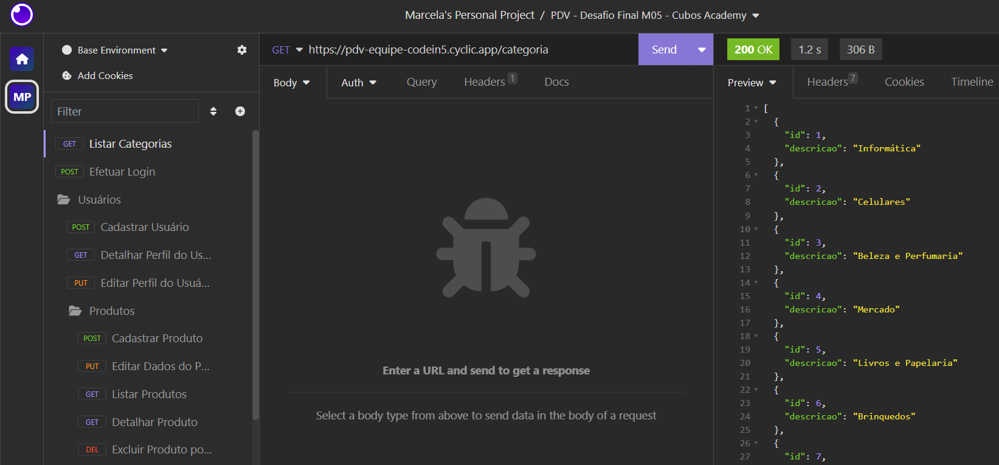
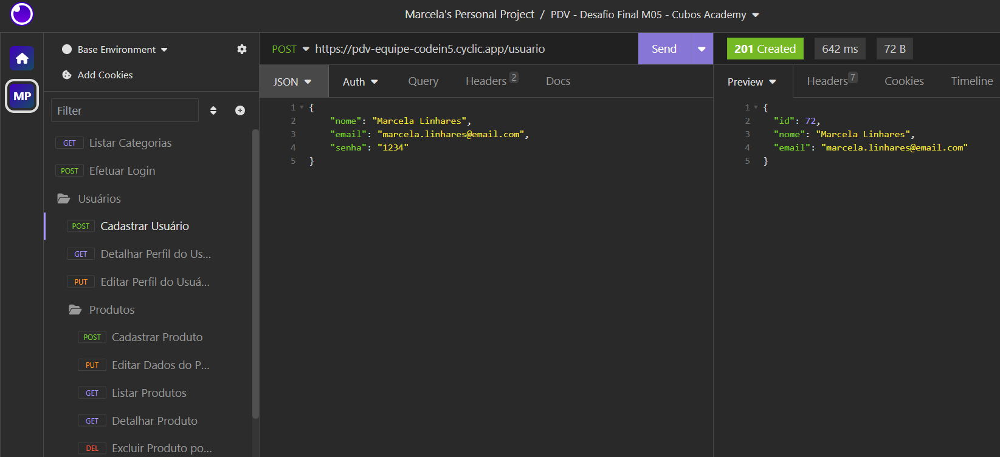
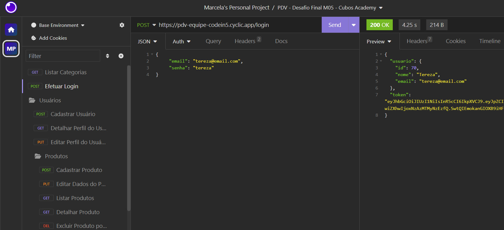

># Sistema-PDV
## 🎯 Menu
- [Descrição do projeto](#-descrição-do-projeto)
  
- [Funcionalidades](#-funcionalidades)

- [Linguagens e Ferramentas utilizadas](#-linguagens-e-ferramentas-utilizadas)

- [Executando o projeto](#-executando-o-projeto)

- [Banco de Dados PostgreSQL "pdv"](#-banco-de-dados-postgresql-pdv)

- [Endpoints no Insomnia](#-endpoints-no-insomnia)

- [Dados armazenados no Banco de Dados "pdv"](#-dados-armazenados-no-banco-de-dados-pdv)

- [Contribua com o Projeto](#-contribua-com-o-projeto)

- [Desenvolvedoras](#-desenvolvedoras)

## 📂 Descrição do projeto
Este projeto foi desenvolvido como Desafio Final do Módulo 05 do curso de Desenvolvimento de Software com foco em Back-end na Cubos Academy. O objetivo principal foi proporcionar prática no fluxo de trabalho em equipe, aplicando metodologias ágeis como o Kanban e Scrum, e explorando o uso de branches para gerenciamento de versões e resolução de conflitos. O projeto foi estruturado em três sprints, cada uma com duração de uma semana, para garantir uma abordagem iterativa e eficiente no desenvolvimento. Como Líder da equipe CodeIn5, tive a oportunidade de contribuir significativamente para o projeto, especialmente na organização das sprints através das metodologias ágeis, além de compartilhar conhecimento sobre a criação e manipulação das branches, e principalmente na motivação do trabalho em equipe. O resultado do nosso esforço conjunto foi reconhecido com o prêmio 🏆 de "Dream Team".

A RESTful API foi desenvolvida para atender às necessidades de um PDV (Frente de Caixa) e foi implantada com sucesso usando a plataforma [Cyclic](https://www.cyclic.sh/), com integração total ao banco de dados PostgreSQL por meio da plataforma [ElephantSQL](https://www.elephantsql.com/), permitindo a persistência e manipulação de dados de usuários, categorias, produtos, clientes e pedidos, fundamentais para o funcionamento da aplicação. Além disso, foram implementadas medidas de segurança, incluindo a criptografia de senhas e autenticação de usuário por meio de tokens, para garantir a proteção dos dados armazenados. Para a comunicação com os clientes, incorporamos o envio de e-mails utilizando o servidor SMTP do [Sendgrid](https://sendgrid.com/en-us/2?adobe_mc_sdid=SDID%3D0C972E2A1A5B44D5-7C455C1ECC21C801%7CMCORGID%3D32523BB96217F7B60A495CB6%40AdobeOrg%7CTS%3D1704917007), notificando-os com informações cruciais sobre os pedidos realizados. A funcionalidade de upload de imagens, seja durante a inclusão ou edição de um produto, é suportada pelo servidor de armazenamento [Backblaze](https://www.backblaze.com/), proporcionando uma solução confiável para a gestão de arquivos no sistema.

## ⚙ Funcionalidades
* Listar categorias
* Cadastrar usuário
* Efetuar login do usuário
* Detalhar perfil do usuário logado
* Editar perfil do usuário logado
* Cadastrar produto
* Editar dados do produto
* Listar produtos
* Detalhar produto
* Excluir produto por ID
* Cadastrar cliente
* Editar dados do cliente
* Listar clientes
* Detalhar cliente
* Cadastrar pedido
* Listar pedido

## 🛠 Linguagens e Ferramentas utilizadas


![Beekeeper](https://img.shields.io/badge/beekeeper-0D1117?style=for-the-badge&logo=data:image/png;base64,iVBORw0KGgoAAAANSUhEUgAAAA4AAAAOCAMAAAAolt3jAAAAIGNIUk0AAHomAACAhAAA+gAAAIDoAAB1MAAA6mAAADqYAAAXcJy6UTwAAAFNUExURQAAAP//a/rXOvPUOejMN/jWOvjWOenQOP/fPP3VOf/nOf/xP+zSOPzYOvvYOo98IfTTOfjWOvjWOfjWOffWOf//R1xQFUc+EO7NN/jWOvjWOfjWOffWOfjWOf/cO5J+IvjWOfjWOfjWOffWOfjWOfjWOvfWOfjWOvjWOvnXO/nXOvjWOvfWOfjWOfjWOfjWOfjWOfjWOvfWOfjWOfjWOfjWOvfWOfjWOfjWOfnXOjoyDe/ON/vYOvzZOv3aO5WBIjkxDd7AM8esLpJ+ItC0MPrYOvjWOZaBIzUuDKONJqSOJj83DiQfCJSAIvXTOTcvDM2xL/HQOObGNXppHBUTBcCmLO/PN/rXOvvZOuTFNSokCZqFJJiDIyslCuXGNeXFNbyiKxQRBH5sHefHNX1sHRUSBb+lLPTSOI57ISMeCJF9IfTTOXtrHM+zMP///548sBYAAAA5dFJOUwAAAAAAAAAAAAAAAAAAABqI7eyGGQpYx/v7xlYKNa729qw0KtTSKWH6aPxiK9U3sPf3C1rJ/ByK7y1GWkAAAAABYktHRG4iD1EXAAAAB3RJTUUH5wkZEwMcxtjpWwAAAJtJREFUCB0FwdtKw0AUQNG9JydOW6wIUgUviOiL4P//iC8iiC0iFQURvFBCMse1BDxQ9dMJw0P1irX6rrOVnqk5bXXrtaeq6s/y2QiZqer8o8soQlXVKBnA7vtcVSGACx3Yaw0IyNAeNaGUNtZah+Gt78dWupPu6KV+HbN63Cz/cHGj88tXctq1fHJ/uFODMTPvq9AtbpXMh9+Jf7viMqPTlzUXAAAAJXRFWHRkYXRlOmNyZWF0ZQAyMDIzLTA5LTI1VDE5OjAzOjI4KzAwOjAwxaUCOQAAACV0RVh0ZGF0ZTptb2RpZnkAMjAyMy0wOS0yNVQxOTowMzoyOCswMDowMLT4uoUAAAAodEVYdGRhdGU6dGltZXN0YW1wADIwMjMtMDktMjVUMTk6MDM6MjgrMDA6MDDj7ZtaAAAAAElFTkSuQmCC&logoColor=5849BE)


## 📤 Executando o projeto

Para começar a utilizar a RESTful API do Sistema PDV na sua máquina, siga estas etapas:

```shell
# 1. Faça o Fork do repositório

# 2. Clone o projeto

git clone <um-dos-links-abaixo>

HTTPS:
https://github.com/MarcelaLinhares/Sistema-PDV.git

SSH:
git@github.com:MarcelaLinhares/Sistema-PDV.git

# 3. No VS Code instale as dependências

npm install

# 4. Execute o servidor

npm run start

```

## 📊 Banco de Dados PostgreSQL "pdv"
Comandos SQL para a criação do Banco de Dados "pdv" e de suas respectivas tabelas no software Beekeeper ou em um software similar.
- [ ] Banco de Dados pdv
```sql
create database pdv;
```

- [ ] Tabela de Usuários
```sql
create table usuarios (
    id serial primary key,
    nome text not null,
    email text not null unique,
    senha text not null
);
```
- [ ] Tabela de Categorias
```sql
create table categorias (
    id serial primary key,
    descricao varchar(255) not null
);
```
- [ ] Tabela de Produtos
```sql
create table produtos (
    id serial primary key,
    descricao varchar(255) not null,
    quantidade_estoque integer not null,
    valor integer not null,
    categoria_id integer not null references categorias(id),
    produto_imagem varchar(255)
);
```
- [ ] Tabela de Clientes
```sql
create table clientes (
    id serial primary key,
    nome text not null,
    email text not null unique,
    cpf varchar(11) not null unique,
    cep text,
    rua text,
    numero integer,
    bairro text,
    cidade text,
    estado char(2)
);
```
- [ ] Tabela de Pedidos
```sql
create table pedidos (
    id serial primary key,
    cliente_id integer not null references clientes(id),
    observacao text,
    valor_total integer not null
);
```
- [ ] Tabela de Pedidos_Produtos
```sql
create table pedido_produtos (
    id serial primary key,
    pedido_id integer not null references pedidos(id),
    produto_id integer not null references produtos(id),
    quantidade_produto integer not null,
    valor_produto integer not null
);
```
- [ ] Inserção das Categorias
```sql
insert into categorias (descricao) values
    ('Informática'),
    ('Celulares'),
    ('Beleza e Perfumaria'),
    ('Mercado'),
    ('Livros e Papelaria'),
    ('Brinquedos'),
    ('Moda'),
    ('Bebê'),
    ('Games');
```

## 📑 Endpoints no Insomnia
Para realizar as requisições com os verbos GET, POST, PUT, DELETE use o framework Insomnia ou similar.

URL Base:
- A API estará disponível em http://localhost:3000
- A API estará disponivel, **por tempo limitado**, atravéz do link do deploy do projeto https://pdv-equipe-codein5.cyclic.app/


- [ ] Listar Categorias - **GET**
```javascript
https://pdv-equipe-codein5.cyclic.app/categoria
```



- [ ] Cadastrar Usuário - **POST**
```javascript
https://pdv-equipe-codein5.cyclic.app/usuario
```
```javascript
// No body (JSON) preencher os dados da requisição:
{
	"nome": "Marcela Linhares",
	"email": "marcela.linhares@email.com",
	"senha": "1234"
}
```



- [ ] Efetuar Login do Usuário - **POST**
```javascript
https://pdv-equipe-codein5.cyclic.app/login
```
```javascript
// No body (JSON) preencher os dados da requisição:
{
	"email": "tereza@email.com",
	"senha": "tereza"
}
```



- [ ] Detalhar Perfil do Usuário Logado - **GET**
```javascript
https://pdv-equipe-codein5.cyclic.app/usuario
```
```javascript
// No Auth (Bearer Token) colar o Token gerado no endpoint "Efetuar Login do Usuário":
TOKEN <colar-token-gerado-no-login-do-usuario>
```

- [ ] Editar Perfil do Usuário Logado - **PUT**

```javascript
https://pdv-equipe-codein5.cyclic.app/usuario
```
```javascript
// No Auth (Bearer Token) colar o Token gerado no endpoint "Efetuar Login do Usuário":
TOKEN <colar-token-gerado-no-login-do-usuario>
```
```javascript
// No body (JSON) preencher os dados da requisição:
{
      "nome": "Débora",
      "email": "debora@email.com",
      "senha": "1234567"
}
```

- [ ] Cadastrar Produto - **POST**
```javascript
https://pdv-equipe-codein5.cyclic.app/produto
```
```javascript
// No Auth (Bearer Token) colar o Token gerado no endpoint "Efetuar Login do Usuário":
TOKEN <colar-token-gerado-no-login-do-usuario>
```
```javascript
// No body (MULTIPART FORM) adicionar os dados da requisição, e a imagem do produto (opcional):
| Campo             | Valor                     |
|-------------------|---------------------------|
| descricao         | Teclado sem Fio Intelbras |
| quantidade_estoque| 15                        |
| valor             | 9800                      |
| categoria_id      | 1                         |
| produto_imagem    | Teclado sem fio.png       |
```

- [ ] Editar Dados do Produto - **PUT**
```javascript
https://pdv-equipe-codein5.cyclic.app/produto/8
```
```javascript
// No Auth (Bearer Token) colar o Token gerado no endpoint "Efetuar Login do Usuário":
TOKEN <colar-token-gerado-no-login-do-usuario>
```
```javascript
// No body (MULTIPART FORM) adicionar os dados da requisição, e a imagem do produto (opcional):
| Campo             | Valor                     |
|-------------------|---------------------------|
| descricao         | Notebook Dell 2 em 1      |
| quantidade_estoque| 2                         |
| valor             | 1050000                   |
| categoria_id      | 1                         |
| produto_imagem    | notebook dell_2 em 1.png  |
```

- [ ] Listar Produto - **GET**
```javascript
https://pdv-equipe-codein5.cyclic.app/produto
```
```javascript
// No Auth (Bearer Token) colar o Token gerado no endpoint "Efetuar Login do Usuário":
TOKEN <colar-token-gerado-no-login-do-usuario>
```
```javascript
// No Query preencher o filtro dos Produtos desejados (filtro opcional, na ausência a listagem é completa):
| Campo             | Valor                     |
|-------------------|---------------------------|
| categoria_id      | 3                         |
| categoria_id      | 7                         |
```

- [ ] Detalhar Produto - **GET**
```javascript
https://pdv-equipe-codein5.cyclic.app/produto/19
```
```javascript
// No Auth (Bearer Token) colar o Token gerado no endpoint "Efetuar Login do Usuário":
TOKEN <colar-token-gerado-no-login-do-usuario>
```

- [ ] Excluir Produto por ID - **DELETE**
```javascript
https://pdv-equipe-codein5.cyclic.app/produto/44
```
```javascript
// No Auth (Bearer Token) colar o Token gerado no endpoint "Efetuar Login do Usuário":
TOKEN <colar-token-gerado-no-login-do-usuario>
```

- [ ] Cadastrar Cliente - **POST**
```javascript
https://pdv-equipe-codein5.cyclic.app/cliente
```
```javascript
// No Auth (Bearer Token) colar o Token gerado no endpoint "Efetuar Login do Usuário":
TOKEN <colar-token-gerado-no-login-do-usuario>
```
```javascript
// No body (JSON) preencher os dados da requisição:
{
	"nome": "Bento",
	"email": "bento@email.com",
	"cpf": "00011122292",
  	"cep": "21765235",
  	"rua": "Capitão Teixeira",
        "numero": 132,
  	"bairro": "Realengo",
  	"cidade": "Rio de Janeiro",
  	"estado": "rj"
}
```

- [ ] Editar Dados do Cliente - **PUT**
```javascript
https://pdv-equipe-codein5.cyclic.app/cliente/24
```
```javascript
// No Auth (Bearer Token) colar o Token gerado no endpoint "Efetuar Login do Usuário":
TOKEN <colar-token-gerado-no-login-do-usuario>
```
```javascript
// No body (JSON) preencher os dados da requisição:
{
	"nome": "Bruna",
	"email": "bruna@email.com",
	"cpf": "00011122292",
  	"cep": "21765450",
  	"rua": "Rua da Alfandega",
        "numero": 115,
  	"bairro": "Centro",
  	"cidade": "Rio de Janeiro",
  	"estado": "rj"
}
```

- [ ] Listar Clientes - **GET**
```javascript
https://pdv-equipe-codein5.cyclic.app/cliente
```
```javascript
// No Auth (Bearer Token) colar o Token gerado no endpoint "Efetuar Login do Usuário":
TOKEN <colar-token-gerado-no-login-do-usuario>
```

## 📥 Dados armazenados no Banco de Dados "pdv"
Visualização dos dados armazenados no banco de dados "pdv" para obter uma visão abrangente do sistema de ponto de venda.
Esses dados foram gerados após a aplicação dos endpoints do projeto, e representam a base essencial do sistema e demonstram a funcionalidade da API RESTful integrada ao Banco de Dados PostgreSQL, com recursos de segurança, como criptografia de senhas, para garantir a proteção dos dados.

## 🤝 Contribua com o Projeto

- [ ] Realize o Fork
- [ ] Faça as modificações
- [ ] Realize o Pull Request (PR)

## 👩‍💻 Desenvolvedoras

<table>
  <tr>
    <td align="center"><a href="https://github.com/MarcelaLinhares"><br /><sub><b>Marcela Linhares</b></sub></a><br /></td>
   
  <td align="center"><a href="https://github.com/debora-silva1"><br /><sub><b>Débora Silva</b></sub></a><br /></td>

   <td align="center"><a href="https://github.com/bruna-rferreira"><br /><sub><b>Bruna Ferreira</b></sub></a><br /></td>

  <td align="center"><a href="https://github.com/KarolayneADP"><br /><sub><b>Karolayne Arantes</b></sub></a><br /></td>

  <td align="center"><a href="https://github.com/HD9312A"><br /><sub><b>Thaís Paixão</b></sub></a><br /></td>
